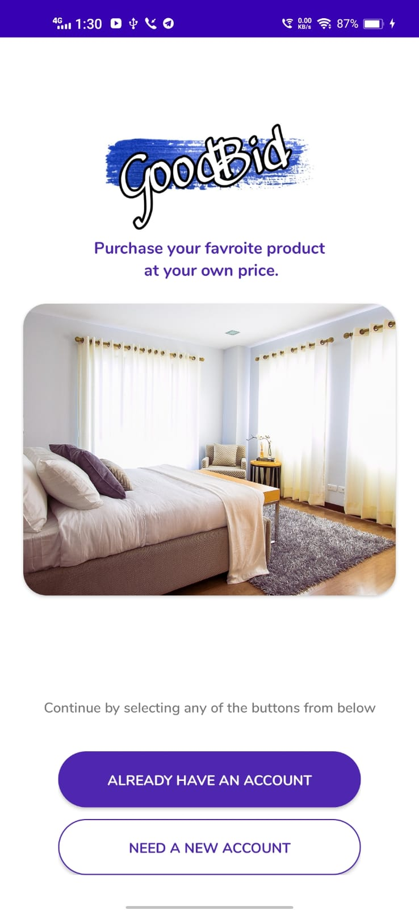
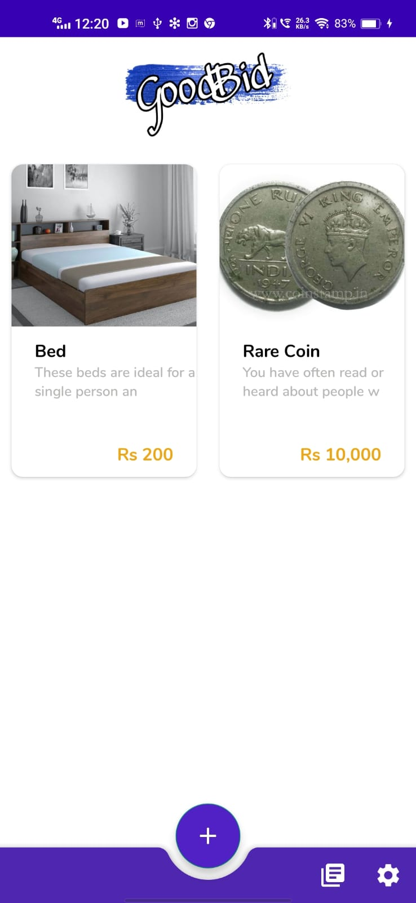
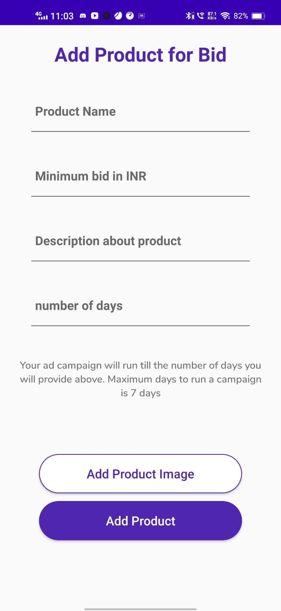
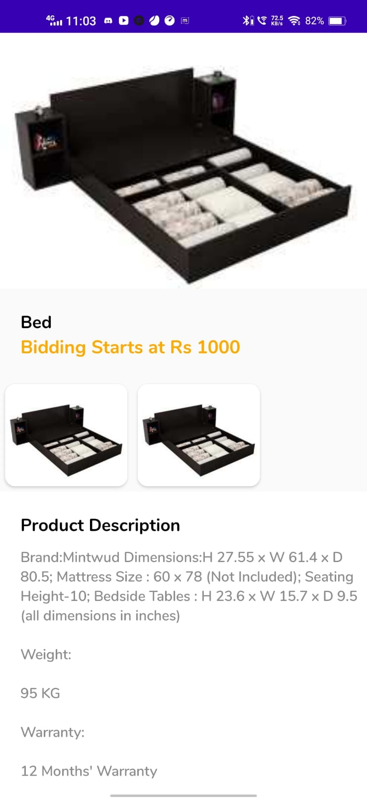
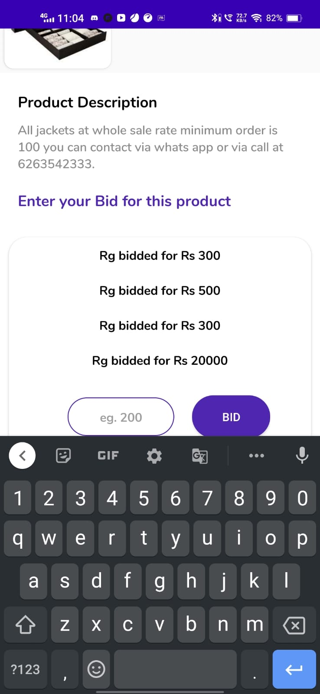
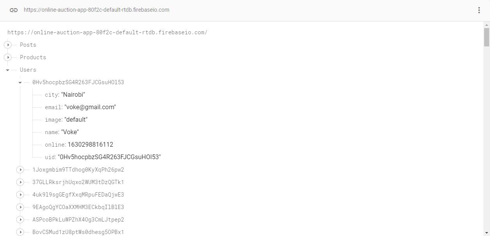
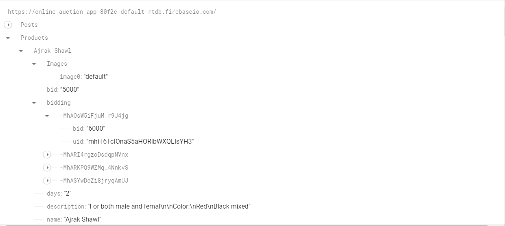

# Online Auction App❤

This app is an online auction app which allows user to upload their valuable product and then they can organize an auction for that product
and once a user entered date is matched the campign gets over and the product is sold to the highest payer. 
This app is totally based on Firebase realtime database and firebase storage.

# App Screenshots🎉

    

# Features of the App

 - This app has no ads and do not contains any in app purchases and is totally free. 
 - Just login and signup
 - Explore all the valueable and rare <b>Products List</b>👀
 - Add your own rare product for auction ✔
 - Here is the product description page ✔
 - and here you can enter your bid ✔

# Backend (Firebase)

- **Firebase is a Backend-as-a-Service (Baas).**
- It provides developers with a variety of tools and services to help them develop quality apps, grow their user base, and earn profit. It is built on Google’s infrastructure.
- Firebase is categorized as a NoSQL database program, which stores data in JSON-like documents.

## User Database

## Product Database

# Configure Firebase 👀
- Create your own project on firebase. 
- download google-services.json 
- Place it in the app folder
- Setup Realtime database in firebase and enable the database by setting true to read & write in the rules tab of relatime database.
- Setup Storage in firebase and enable it by setting true to read and write in the rules of storage. 
- Setup authentication in firebase and enable email/password authentication.
- You are good to go.👌👌

# License
Licensed under the [Apache Licence 2.0](LICENSE).
